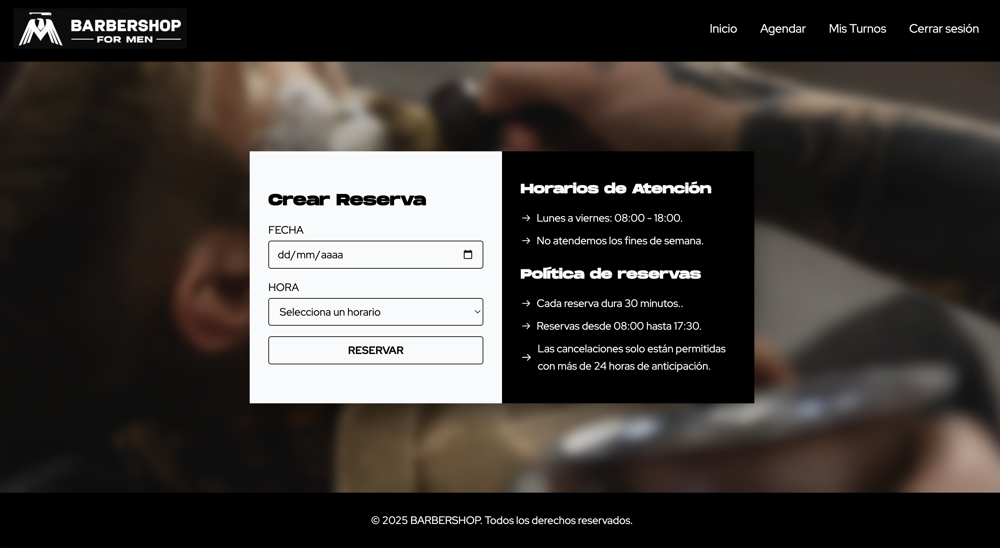

# 💈 Gestor de Turnos — Barbershop (Fullstack)

**Gestor de Turnos – Barbershop** es una aplicación full‑stack para la administración de citas en una barbería.  
Permite a los usuarios registrarse, iniciar sesión, reservar turnos, cancelarlos y recibir notificaciones por email.

Pensado con enfoque **responsive**, buenas prácticas y arquitectura escalable.

---

## 🚀 Objetivo del proyecto

Crear un sistema moderno y fácil de usar para:

- Organizar turnos sin planillas manuales
- Reducir errores de agenda
- Mejorar la comunicación con los clientes
- Centralizar gestión desde un solo panel

---

## 🧠 Funcionalidades principales

- ✅ Página pública con branding de la barbería
- ✅ Registro y login de usuarios
- ✅ Sistema de reservas con fecha y hora
- ✅ Visualización y cancelación de turnos
- ✅ Envío de email de confirmación
- ✅ Diseño responsive y UI moderna
- ✅ Backend con validaciones y buenas prácticas

---

## 🛠️ Tecnologías utilizadas

### **Frontend**

- ⚛️ React
- ⚡ Vite
- 🎨 Tailwind CSS
- 🔀 React Router

### **Backend**

- 🟩 Node.js
- 🚏 Express.js
- 🐘 PostgreSQL + TypeORM
- ✉️ Nodemailer
- 🔐 Dotenv

---

## 🖼️ Capturas del sitio

| Home                                               | Registro                                                   | Login                                                |
| -------------------------------------------------- | ---------------------------------------------------------- | ---------------------------------------------------- |
|  |  |  |

| Agendar turno                                            | Vista de reservas                                                   |
| -------------------------------------------------------- | ------------------------------------------------------------------- |
|  |  |

---

## 📁 Estructura del proyecto

```bash
Gestor-de-Turnos/
├── back/                        # Backend (Node.js + PostgreSQL + TypeORM)
│   └── src/
│       ├── config/              # Configuración general (DB, server, etc.)
│       ├── controllers/         # Lógica de controladores
│       ├── dtos/                # Objetos de transferencia de datos (TypeScript)
│       ├── entities/            # Entidades de la base de datos (TypeORM)
│       ├── interfaces/          # Tipado adicional
│       ├── middlewares/         # Middlewares (auth, errores, etc.)
│       ├── repositories/        # Acceso a datos (repos personalizados)
│       ├── routes/              # Definición de endpoints
│       ├── services/            # Lógica de negocio
│       └── utils/               # Funciones utilitarias
│
└── front/                       # Frontend (React + Vite)
    └── src/
        ├── assets/              # Recursos estáticos (imágenes, íconos, etc.)
        ├── components/          # Componentes reutilizables
        ├── context/             # Context API para estado global
        ├── helpers/             # Funciones utilitarias
        ├── hooks/               # Custom hooks (manejo de lógica)
        ├── App.jsx              # Enrutamiento principal
        └── main.jsx             # Punto de entrada

```
