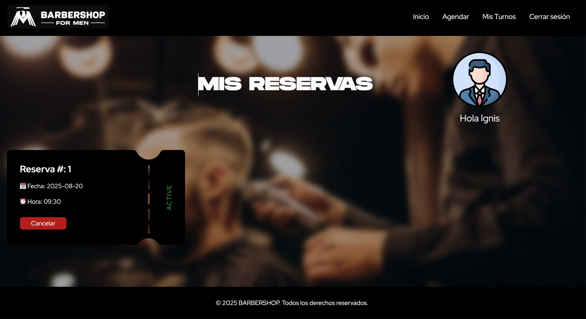

# 💈 Gestor de Turnos – Barbershop

Aplicación **fullstack** para la gestión de turnos en una barbería.  
Los usuarios pueden registrarse, iniciar sesión, reservar citas, cancelarlas y recibir notificaciones por correo electrónico.

---

## 🛠️ Tecnologías utilizadas

**Frontend**

- React
- Vite
- Tailwind CSS
- React Router

**Backend**

- Node.js
- Express.js
- PostgreSQL + TypeORM
- Nodemailer
- Dotenv

---

## 📌 Funcionalidades

- Página pública con branding de la barbería.
- Registro de usuario (formulario validado).
- Login seguro.
- Agendamiento de turnos con selector de fecha y hora.
- Visualización y cancelación de reservas.
- Envío de email de confirmación.
- Diseño responsive y UI moderna.

---

## 🖼️ Demo visual

### 🏠 Home


### 📝 Registro


### 🔐 Login de usuario


### 📅 Agendar un turno


### 📋 Vista de reservas



## 🧪 Buenas prácticas aplicadas

- Tipado y organización de **DTOs/Interfaces** (TypeScript en back).
- **Ruteo** y **protección de rutas** (React Router).
- **Manejo de estado** con hooks.
- **ORM** con TypeORM (entidades, repositorios y relaciones).
- Buenas prácticas: separación por capas, manejo de errores y variables de entorno.

---

## ⚙️ Instalación y uso

```bash

### 🔁 Clonar el repositorio
git clone https://github.com/JCesarAguilar/Gestor-de-Turnos.git
cd Gestor-de-Turnos

---

## 📦 Backend

# Entrar al directorio del backend

cd back

# Instalar dependencias

npm install

# Copiar archivo de entorno

cp .env.example .env

# Editar el archivo .env con tus variables reales

# Ejecutar el servidor

npm run dev

---

## 💻 Frontend

# Ir al frontend

cd ../front

# Instalar dependencias

npm install

# Ejecutar la app

npm run dev
```
